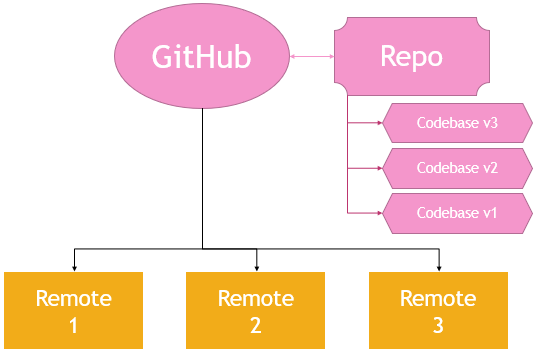
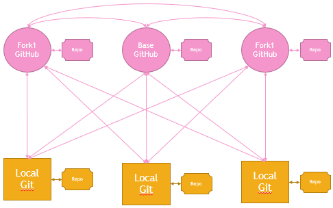
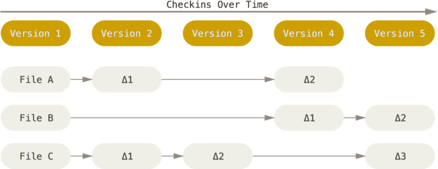
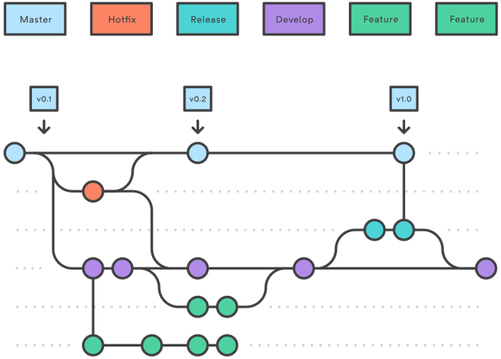
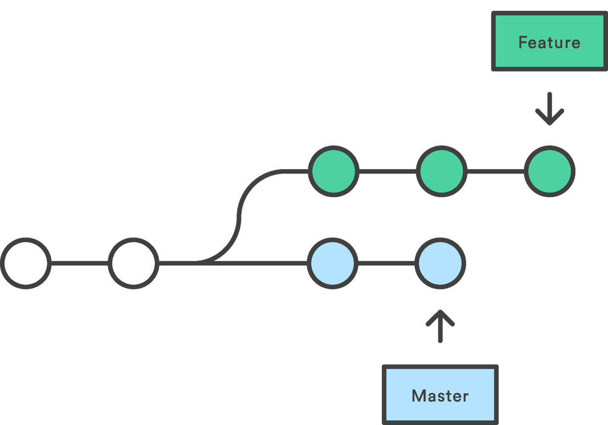
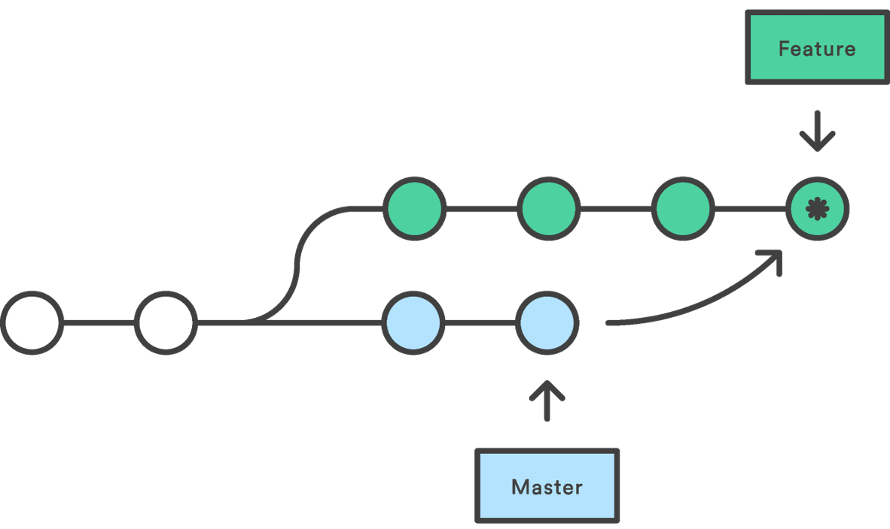
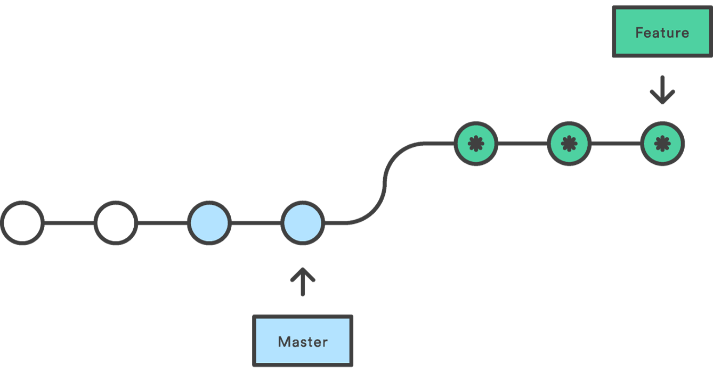
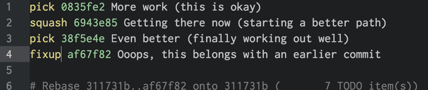

# Git Essentials
### Jeremy Foster
### Tobiah Zarlez

---

# Overview

### Jeremy Foster
### Tobiah Zarlez

--

## What is git?

* Git is a distributed revision control system.
* Industry standard for version control and source code management systems.
* Completely free and open source
* Various hosting services out there (GitHub, VSTS, etc.) with both free and paid tiers

--

## How git DOESN'T work



--

## How git ACTUALLY works



--

## The great GUI vs. CLI debate

Definitive answer: Either option is fine

(Though CLI is much better)

--

## config

* ```git config --global user.name “Tobiah Zarlez“```
* ```git config --global user.email “TobiahZ@users.noreply.github.com” ```

--

## init and clone

[Demo time!]

---

# Git Basics
### Commit your work

### Tobiah Zarlez

--

## Git saves a series of changes



--

## Git status

* What's going on with your project?

--

## staging, add, and commit

[Demo time!]

--

## git ignore

---

# Branch, Merge, and Rebase

### Jeremy Foster

--



--

## log

--

## branch



--

## checkout

--

## merge



--

## rebase



--

## interactive rebase



---

# Sharing and Updating Projects

### Tobiah Zarlez

--

## origin and remotes

--

## push, pull and fetch

--

## pull requests 101

---

# Tips and Tricks

### Jeremy Foster
### Tobiah Zarlez


--

## difftool/mergetool

--

## reflog

--

## lg alias

--

## local cloning

--

## multiple remotes

--

## patch add (and in VS Code)

--

## Discard local changes

Reset local change (Discard)
```
git clean –f
git reset --hard HEAD
```

--

## Committed to the wrong branch

```
git branch feature
git reset --hard origin/master
git checkout feature
```

--

## git-LFS


--

## Find the Bug

```
git bisect start, git bisect bad, git bisect good <commit SHA>
```

---

# Q&A
### Jeremy Foster
### Tobiah Zarlez

* Git - https://git-scm.com/download/
* Git-LFS - https://git-lfs.github.com/ 
* VSCode - https://code.visualstudio.com/ 